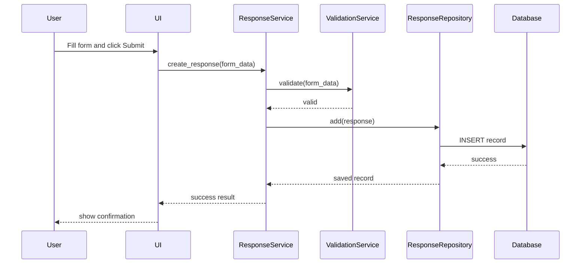
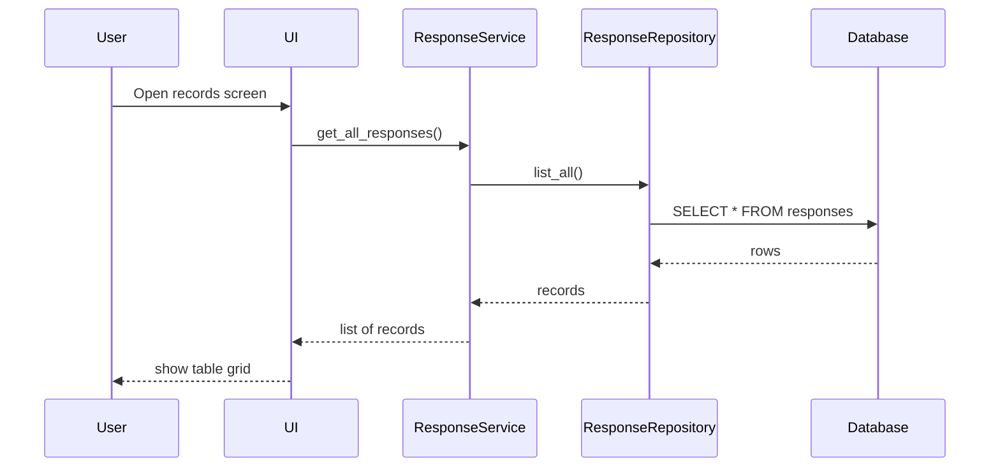

# Detailed Design Document

## 1. Document Purpose
This document translates the architectural direction in [architecture_document.md](architecture_document.md) into a concrete, implementation-ready design for a Python desktop application that replaces the existing VBA-based Excel solution.

The solution is designed to preserve the current capability of collecting response records while improving maintainability, validation, and data integrity. It follows a layered architecture with a desktop UI, a business service layer, domain models, and a SQLite-backed repository layer.

## 2. System Context
The current system is a workbook-driven VBA form that collects basic respondent information and a single question response. The new system will replace the workbook dependency with a desktop application that stores records in a database and exposes a more robust user workflow.

### 2.1 Existing Business Inputs
- Response ID
- Start time
- Completion time
- Email address
- Name
- Question / response text

### 2.2 Existing Business Outputs
- Saved response records in a structured table
- User confirmation after submit
- Optional export to spreadsheet format

## 3. Design Goals
### 3.1 Functional Goals
- Allow a user to complete a response form
- Validate required fields before saving
- Record timestamps accurately
- Save data persistently in a local database
- Display saved records in a list/report view
- Export records to CSV or Excel when needed

### 3.2 Quality Goals
- Easy to maintain and test
- Clear isolation between UI, service, and data logic
- Avoids dependency on spreadsheet cells and macros
- Provides friendly validation and recovery messages

### 3.3 Constraints
- Desktop-first application
- Single-user local deployment for v1
- Must support future extension to multi-user or server deployment
- Must remain compatible with Excel export expectations where necessary

## 4. High-Level Design
The application will be implemented as a layered desktop system:

- Presentation layer: UI screens and navigation
- Application layer: orchestration and validation workflows
- Domain layer: entities and business rules
- Data access layer: repositories and database handling
- Integration layer: Excel/CSV export support

### 4.1 Major Components
1. App shell
2. Main form screen
3. Response list screen
4. Response service
5. Validation service
6. Response repository
7. SQLite database
8. Export service
9. Logging and configuration

## 5. Solution Architecture
### 5.1 Layered Architecture
The application will use a classic layered architecture to separate concerns.

#### Presentation Layer
Responsibilities:
- display form fields
- handle user input
- show validation messages
- trigger save and export actions

Technologies:
- PySide6 (recommended for production desktop UI)
- Alternately tkinter for minimal deployment

#### Application Layer
Responsibilities:
- validate submissions
- manage the response lifecycle
- coordinate save and export actions
- handle application-level exceptions

Services:
- ResponseService
- ValidationService
- ExportService
- AuditService (optional for v1)

#### Domain Layer
Responsibilities:
- represent response records
- define business invariants
- encapsulate domain validations

Entities:
- ResponseRecord
- SubmissionStatus

#### Data Access Layer
Responsibilities:
- create and manage database connections
- persist and retrieve records
- abstract SQL work from the rest of the application

Repositories:
- ResponseRepository
- DatabaseContext

#### Integration Layer
Responsibilities:
- read/write Excel-compatible files
- export CSV data for spreadsheet compatibility
- support future API/provider integration if needed

## 6. Use Cases
### 6.1 Create Response
Primary actor: end user

Flow:
1. User opens the application.
2. User enters name, email, and response question.
3. User clicks Submit.
4. System validates fields.
5. System stores record with timestamps.
6. System confirms submission.

### 6.2 View Existing Responses
Primary actor: admin or reviewer

Flow:
1. User opens the records screen.
2. System loads saved responses.
3. User filters or searches if needed.
4. User reviews submission details.

### 6.3 Export Responses
Primary actor: admin or analyst

Flow:
1. User selects export action.
2. System converts records to CSV or Excel format.
3. System writes file to chosen destination.
4. System confirms export completion.

### 6.4 Validate Input
Primary actor: system

Rules:
- email must be valid
- name must not be empty
- question must not be empty
- start and completion timestamps must be consistent

## 7. Functional Components
### 7.1 App Shell
The app shell provides the main application window and layout container.

Responsibilities:
- initialize application settings
- create navigation between screens
- manage global status and error messages
- create database connection at startup

### 7.2 Main Form Screen
This screen replaces the Excel/ VBA form.

Fields:
- Name
- Email
- Question
- Start time
- Completion time
- Submit button
- Cancel button

Behavior:
- Auto-populate start time when form opens
- Set completion time on submit
- Disable submit if required fields are invalid
- Show inline or dialog error messages

### 7.3 Response List Screen
This screen shows previously saved records.

Features:
- searchable list
- sort by name, timestamp, or status
- row details panel
- export button
- open record for editing if needed

### 7.4 Response Service
Purpose: coordinate the domain and persistence logic.

Methods:
- create_response(form_data)
- get_all_responses()
- get_response_by_id(id)
- update_response(id, updates)
- delete_response(id)
- export_responses(format, destination)

Validation:
- checks required fields
- ensures email validity
- enforces allowed timestamps

### 7.5 Validation Service
This service centralizes cross-cutting validation logic.

Rules:
- email regex validation
- trim whitespace around text inputs
- reject empty or only-whitespace values
- ensure completion_time >= start_time
- ensure question length is within limits if configured

### 7.6 Response Repository
Provides persistence access to the database.

Methods:
- add(response)
- get_by_id(id)
- list_all()
- update(response)
- delete(id)

Responsibilities:
- SQL execution abstraction
- normalization of database rows to domain objects

### 7.7 Export Service
Responsible for generating spreadsheet-compatible output.

Supported formats:
- CSV
- Excel (.xlsx)

Requirements:
- export selected records or full table
- maintain same field names as domain model
- preserve timestamp values in readable format

## 8. Domain Model Design
### 8.1 ResponseRecord
This is the core business object.

Attributes:
- id: UUID or integer primary key
- name: str
- email: str
- question: str
- start_time: datetime
- completion_time: datetime
- status: str
- created_at: datetime
- updated_at: datetime

### 8.2 SubmissionStatus Enum
Possible values:
- draft
- submitted
- cancelled

### 8.3 Validation Rules
- name is required
- email is required and valid
- question is required and not empty
- completion_time cannot precede start_time
- status must be from approved enum list
- id must be unique

## 9. Data Design
### 9.1 Database Choice
SQLite will be used for v1 because it is:
- file-based
- easy to deploy
- low overhead for a standalone desktop app
- sufficient for a single-user application that needs persistence

### 9.2 Database Schema
Table: responses

Columns:
- id TEXT PRIMARY KEY
- name TEXT NOT NULL
- email TEXT NOT NULL
- question TEXT NOT NULL
- start_time TEXT NOT NULL
- completion_time TEXT NOT NULL
- status TEXT NOT NULL DEFAULT 'submitted'
- created_at TEXT NOT NULL
- updated_at TEXT NOT NULL

Optional future table:
- audit_log
  - id
  - response_id
  - action
  - performed_at
  - details

### 9.3 Data Types
Because SQLite stores values as text when needed, timestamps will be stored in ISO 8601 format for consistency.

Example:
- 2026-10-02T09:30:00Z

## 10. UI Design
### 10.1 Screen Layout
Main form layout:
- header title: "Response Form"
- name field
- email field
- question text area
- start time display label
- submit button
- cancel button

Main list layout:
- toolbar with add, refresh, export
- table with columns: ID, Name, Email, Start Time, Completion Time, Status
- detail panel

### 10.2 UX Requirements
- clear required field indicator
- immediate validation feedback on field blur or submit
- successful submission message
- confirmation before delete or overwrite if implemented
- readable layout for large desktop monitors

## 11. Sequence Flows
### 11.1 Submit Response Flow

### 11.2 View Records Flow

## 12. Error Handling Strategy
### 12.1 Validation Errors
Examples:
- email invalid
- required field missing
- completion time earlier than start time

Handling:
- show inline errors near the field
- block save operation
- prevent database insert

### 12.2 Data Errors
Examples:
- database file not found
- database write failure
- invalid record state

Handling:
- log the exception
- show friendly user message
- if possible, recover gracefully or allow retry

### 12.3 Application Errors
Examples:
- export path unavailable
- permission denied

Handling:
- show a modal error dialog
- record details in logs
- keep the app running when possible

## 13. Configuration and Environment
### 13.1 Configuration Items
- database path
- export directory
- default UI theme
- logging level
- app version

### 13.2 Configuration File
A lightweight config file or environment-driven settings can be used.

Example:
- settings.json
- .env file

## 14. Security Design
For v1, the deployment is local and standalone. Security will remain light but should still include:
- no hardcoded secrets
- local-only storage of data files
- limited file permissions on export folders
- validation of user-entered data before persistence

For future versions:
- authentication
- encryption of data at rest
- role-based access
- audit trails

## 15. Testing Strategy
### 15.1 Unit Tests
Focus on domain validation and service logic.

Examples:
- valid response saves successfully
- invalid email fails validation
- start time greater than completion time fails
- question field cannot be blank

### 15.2 Repository Tests
- insert record persists correctly
- fetch by ID returns correct record
- list all returns expected ordering
- update changes underlying row

### 15.3 UI Tests
- form submits only when valid
- validation messages appear correctly
- export button creates file

### 15.4 Integration Tests
- application opens DB and loads records
- record creation through service -> repository -> DB works end-to-end

## 16. Deployment Design
### 16.1 v1 Target Deployment
- local desktop installation
- SQLite database stored in user data directory
- packaged executable using PyInstaller

### 16.2 Installation Model
- single installer package
- app data folder created on first run
- database initialized automatically if missing

### 16.3 Packaging Strategy
- Python app packaged into executable for Windows desktop deployment
- optional installer for enterprise distribution

## 17. Implementation Plan
### Phase 1: Core Infrastructure
- project scaffolding
- database initialization
- model definitions
- repository classes
- configuration settings

### Phase 2: Desktop UI
- layout and navigation
- form fields and validation feedback
- submission action
- response list screen

### Phase 3: Business Logic
- response service
- validation rules
- export service
- logging

### Phase 4: Testing and Hardening
- unit tests
- integration tests
- packaging and production verification

## 18. Risks and Mitigations
### Risk: Hidden spreadsheet logic not captured
Mitigation: review workbook and form structure thoroughly before implementation.

### Risk: Field validation is incomplete
Mitigation: implement validation service with explicit rules and tests.

### Risk: App becomes tightly coupled to UI
Mitigation: use service/repository separation and avoid direct DB access from the UI.

### Risk: Data migration is inconsistent
Mitigation: export original workbook data for comparison after migration.

## 19. Acceptance Criteria
The v1 implementation will be considered complete when:
- the user can open the app and fill the response form
- required fields are validated before saving
- a record is stored in SQLite
- records can be listed and filtered
- export to CSV or Excel works
- app starts without manual database setup
- tests cover validation and repository behavior

## 20. Recommended Project Structure
project/
- app/
  - ui/
    - main_window.py
    - form_screen.py
    - records_screen.py
  - services/
    - response_service.py
    - validation_service.py
    - export_service.py
  - domain/
    - response_record.py
    - status.py
  - repositories/
    - response_repository.py
    - db_context.py
  - config/
    - settings.py
- data/
  - app.db
  - exports/
- tests/
  - test_validation.py
  - test_repository.py
  - test_service.py
- requirements.txt
- main.py
- README.md

## 21. Summary
The detailed design preserves the original business intent of the spreadsheet application while replacing macro-driven behavior with a proper Python desktop architecture. The design emphasizes maintainability, testability, and long-term extensibility while staying suitable for a single-user local deployment in the initial version.
